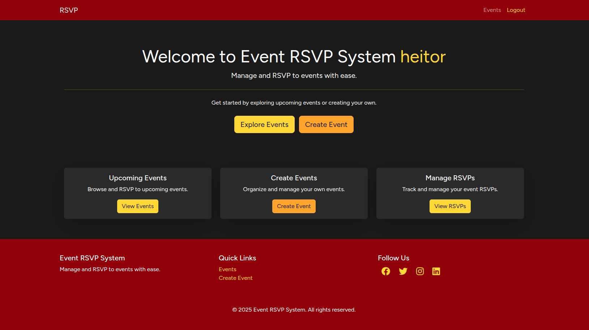
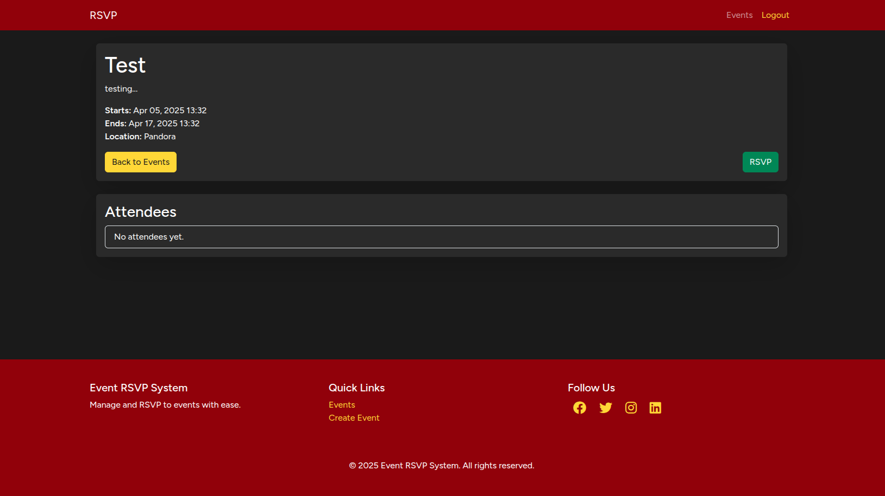

# RSVP System for Events

This is a simple RSVP system for responding to any invitation. It allows users to create events, RSVP in already created events and see all attendees of a event.

## Technologies Used
- **Backend**: Laravel (PHP)
- **Frontend**: Blade Templates
- **Database**: MySQL